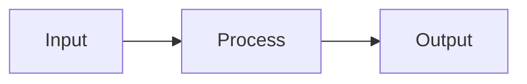

# md2pdf

A powerful, interactive command-line tool for converting Markdown files to PDF or HTML with support for mathematical equations, Mermaid diagrams, and code syntax highlighting.

## Features

- 🎨 **4 Professional Themes**: Academic, Modern, Minimal, Presentation
- 📐 **Math Equations**: Full KaTeX support for LaTeX math
- 📊 **Mermaid Diagrams**: Flowcharts, sequence diagrams, and more
- 💻 **Code Highlighting**: Syntax highlighting for 180+ languages
- 🔄 **Batch Processing**: Convert multiple files at once
- ⚙️ **Interactive CLI**: User-friendly prompts for all options
- 🎯 **Custom Filenames**: Choose output names or use defaults
- 📦 **No Config Required**: Works out of the box with sensible defaults

## Quick Start

### Prerequisites

- Python 3.9+
- Node.js 16+
- npm (comes with Node.js)

### Installation

1. **Clone or download this repository**

2. **Install Python dependencies**:
```bash
pip install -r requirements.txt
```

3. **Install Node.js dependencies** (for PDF rendering):
```bash
cd renderer
npm install
cd ..
```

### Usage

**Interactive Mode:**
```bash
python3 md2pdf.py
```

Follow the prompts to:
1. Select file(s) to convert (supports glob patterns like `*.md`)
2. Choose output format (PDF or HTML)
3. Select theme (Academic, Modern, Minimal, Presentation)
4. Choose filename (for single files)

**Example Session:**
```
=== md2pdf: Markdown to PDF/HTML Converter ===

📄 File Selection
Files: document.md

📄 Output Format
Select output format:
  1. PDF (print-ready)
  2. HTML (web-ready)
Format [1]: 1

🎨 Theme Selection
Select theme:
  1. Academic - Serif, traditional scholarly style
  2. Minimal - Clean, simple, maximum readability
  3. Modern - Sans-serif, colorful web style
  4. Presentation - Large fonts, dark background
Theme [1]: 1

📝 Output Filename
Default: document.pdf
Use default filename? [Y/n]: y

🔄 Processing 1 file(s)
Format: pdf, Theme: academic

🚀 Starting renderer service...
✓ Renderer service ready
  ✓ document.md → converted/document.pdf (45,234 bytes)

✓ Renderer service stopped
📊 Conversion complete: 1 succeeded, 0 failed
✓ Conversion complete!
```

Output will be in `converted/` subdirectory relative to your input file.

## Supported Markdown Features

### Basic Formatting
- **Bold**, *italic*, `inline code`
- Headings (H1-H6)
- Lists (ordered, unordered, nested)
- Blockquotes
- Horizontal rules
- Links and images

### Advanced Features

**Math Equations (KaTeX):**
```markdown
Inline: $E = mc^2$

Block:
$$
\int_{-\infty}^{\infty} e^{-x^2} dx = \sqrt{\pi}
$$
```

**Mermaid Diagrams:**
```markdown

```

**Code with Syntax Highlighting:**
```markdown
```python
def hello(name):
    print(f"Hello, {name}!")
```
```

**Tables:**
```markdown
| Header 1 | Header 2 |
|----------|----------|
| Cell 1   | Cell 2   |
```

## Themes

### Academic
- **Best for**: Papers, reports, theses
- **Style**: Serif fonts (Times New Roman), traditional margins, justified text
- **PDF Size**: Optimized for printing with proper page breaks

### Modern
- **Best for**: Web documentation, blog posts
- **Style**: Sans-serif fonts, colorful accents, rounded corners
- **Appearance**: GitHub-inspired clean design

### Minimal
- **Best for**: Reading-focused documents
- **Style**: System fonts, maximum readability, no decorations
- **Philosophy**: Less is more

### Presentation
- **Best for**: Slides, screen display
- **Style**: Large fonts, dark background, high contrast
- **Colors**: Color-coded headings for visual hierarchy

## Configuration

Edit `md2pdf.config.yaml` to customize:

- Default output format (PDF or HTML)
- Default theme
- PDF page size (Letter, A4, Legal)
- PDF margins
- Rendering delays (for complex diagrams)
- Mermaid theme mappings

Example:
```yaml
output:
  format: pdf
  default_theme: academic

pdf_options:
  page_size: letter
  margins:
    top: 1in
    bottom: 1in
    left: 1in
    right: 1in
```

## Architecture

**Components:**
- **Python CLI** (`md2pdf.py`): Interactive interface and orchestration
- **Markdown Renderer** (`markdown_renderer.py`): Markdown → HTML conversion
- **Theme Manager** (`theme_manager.py`): CSS theme loading
- **Renderer Client** (`renderer_client.py`): HTTP client for PDF service
- **Node.js Renderer** (`renderer/server.js`): Puppeteer-based PDF generation

**Workflow:**
```
Markdown File → Python CLI → HTML (with CSS/JS) → Node.js/Puppeteer → PDF
```

## Testing

Run the test suite:
```bash
pytest tests/ -v
```

Expected: 54/54 tests passing

See [TESTING.md](TESTING.md) for manual testing checklist.

## Troubleshooting

**Issue: "Server failed to start"**
- Ensure Node.js and npm are installed: `node --version && npm --version`
- Install renderer dependencies: `cd renderer && npm install`

**Issue: "No module named 'click'"**
- Install Python dependencies: `pip install -r requirements.txt`

**Issue: PDFs missing diagrams or math**
- Increase `wait_for_rendering` in config (default 1000ms)
- Complex diagrams may need 2000-3000ms

**Issue: Unicode characters not displaying**
- Ensure input files are UTF-8 encoded

## Development

**Project Structure:**
```
md2pdf/
├── md2pdf.py              # Main CLI
├── markdown_renderer.py   # Markdown → HTML
├── theme_manager.py       # Theme management
├── config_loader.py       # Configuration
├── renderer_client.py     # HTTP client
├── md2pdf.config.yaml     # Configuration file
├── requirements.txt       # Python dependencies
├── themes/                # CSS themes
│   ├── academic.css
│   ├── modern.css
│   ├── minimal.css
│   └── presentation.css
├── templates/             # HTML templates
│   └── base.html
├── renderer/              # Node.js service
│   ├── server.js
│   └── package.json
└── tests/                 # Test suite
    ├── test_cli.py
    ├── test_config_loader.py
    ├── test_markdown_renderer.py
    ├── test_theme_manager.py
    └── test_renderer_client.py
```

**Adding a New Theme:**
1. Create `themes/yourtheme.css`
2. Add theme description to `md2pdf.py` (prompt_theme_selection)
3. Add Mermaid mapping to `md2pdf.config.yaml`

## Performance

- **Startup**: ~0.5s (renderer service)
- **Single PDF**: ~2-3s (includes rendering delay for diagrams)
- **Batch Mode**: Efficient (single server instance reused)

**File Sizes (typical):**
- Simple 1-page: 30-60 KB
- Medium 2-page: 100-150 KB
- Complex 4-page: 250-300 KB

## License

MIT License - see [LICENSE](LICENSE) file for details.

## Contributing

Contributions welcome! Please:
1. Fork the repository
2. Create a feature branch
3. Add tests for new functionality
4. Ensure all tests pass (`pytest tests/ -v`)
5. Submit a pull request

## Credits

Built with:
- [Click](https://click.palletsprojects.com/) - CLI framework
- [markdown-it-py](https://github.com/executablebooks/markdown-it-py) - Markdown parsing
- [Jinja2](https://jinja.palletsprojects.com/) - HTML templating
- [Puppeteer](https://pptr.dev/) - PDF generation
- [KaTeX](https://katex.org/) - Math rendering
- [Mermaid](https://mermaid.js.org/) - Diagram rendering
- [Highlight.js](https://highlightjs.org/) - Code highlighting

## Author

Created as a demonstration project for high-quality TDD and microservice architecture
